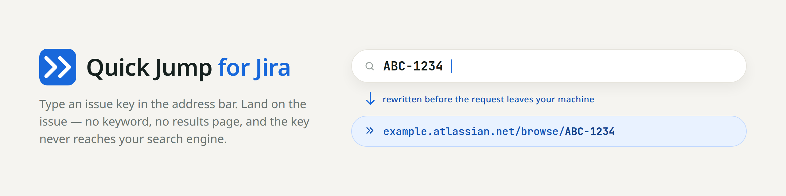
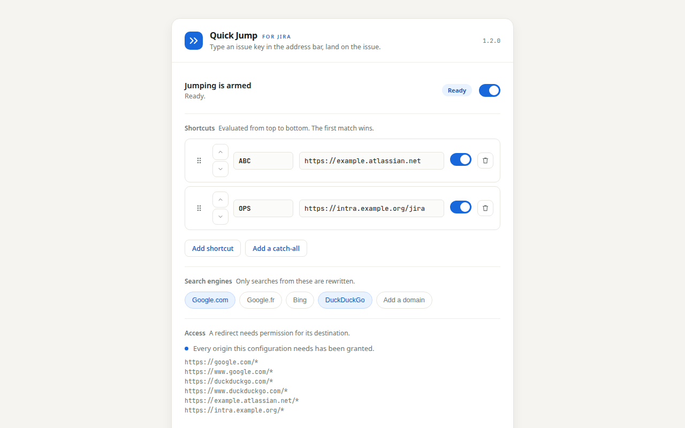

<div align="center">

<picture>
  <source media="(prefers-color-scheme: dark)" srcset="docs/assets/banner-dark.png">
  
</picture>

<p>
  
  
  
</p>

<sub>Jira is a trademark of Atlassian. This extension is not affiliated with, endorsed by, or produced by Atlassian.</sub>

</div>

---

```
ABC-1234   →   https://example.atlassian.net/browse/ABC-1234
```

No keyword. No tab key. No results page. Just the key you already know by heart.

## Install

Released on GitHub, not through a store.

1. Download the package for your browser from **[Releases](https://github.com/RomainMILLAN/Jira-Quick-Jump/releases)**.
2. Load it — **[INSTALL.md](INSTALL.md)** has the click-by-click for Chrome and for Firefox, including how to pin a signed build for a team.
3. Open the options page and follow the four steps below.

Prefer to build it yourself? `npm ci --ignore-scripts && make build` produces both packages.

## Set it up



1. **Pick your search engine.** Whatever your address bar actually uses. Google.com, Google.fr, Bing and DuckDuckGo are listed; anything else — `google.it`, Ecosia, a self-hosted SearxNG — you add with **Add a domain**. One entry per domain is deliberate: the permission prompt then contains only what you ticked, instead of every Google top-level domain in existence.

2. **Add a shortcut.** A key (`ABC`) and where it points (`example.atlassian.net`). Self-hosted works properly: a port and a path are both accepted, so `intra.example.org/jira` is fine, and so is `http://jira:8080`. The list is **evaluated from top to bottom and the first match wins**; the arrows on each row reorder it.

3. **Grant access.** One browser prompt, naming the host. Nothing redirects before you do this.

4. **Arm it**, then try the jump once and look at where you land. **Try a URL** also accepts the bare text you would type, so you can check what is claimed and what is not.

Want one instance to catch everything you have not declared? That is the **catch-all**, and it comes with strings attached — see below.

## Why not a bookmark keyword?

Because of what happens in the half second after you press Enter.

|  | Bookmark keyword | Chrome site search | Quick Jump |
|---|:---:|:---:|:---:|
| A keyword to type first | yes | yes | **no** |
| A results page paints | no | no | **no** |
| Your issue key reaches the search engine | yes | yes | **no** |

Chrome's site search and the `omnibox` API both need a keyword before the address bar will hand anything to an extension. This extension uses the one seam they leave: when what you typed is not a URL, the browser builds a navigation towards your default search engine, and `declarativeNetRequest` rewrites that navigation **before the request leaves your machine**.

So there is no round trip, and no flash of Google before Jira. And typed dozens of times a day, an internal project key is a rich signal — which projects you work on, at what pace, and, if you click a result, the host name of your internal Jira. That request simply does not happen.

## Privacy

**The extension makes no network request of any kind.** Its pages declare `connect-src 'none'`, which makes `fetch`, XHR, WebSocket and `sendBeacon` impossible from them — a checkable fact, not a promise. No account, no server, no analytics. Your shortcuts stay on your device unless you explicitly turn syncing on.

One honest caveat, and it is the important one: **your browser still sends address-bar keystrokes to your search engine's *suggestion* endpoint as you type**, over a channel no extension can intercept. If suggestions are on — the default in both browsers — the key reaches Google anyway, character by character, before you press Enter. Turning suggestions off is the only real remedy: `chrome://settings/syncSetup` → *Search suggestions*, or Firefox's *Settings → Search → Provide search suggestions*.

Full detail: **[PRIVACY.md](PRIVACY.md)**. The threat model and the control inventory: **[SECURITY.md](SECURITY.md)**.

<details>
<summary><b>The trust model, said plainly</b></summary>

<br>

**The product teaches you not to look at the address bar.** That is the whole point: you type a key and stop thinking about the URL. Which means that if something ever pointed a key at the wrong server, the habit the extension built is exactly the habit that would stop you noticing.

So the extension shows you the destination everywhere else:

- Every shortcut displays its **whole destination**, host and path, on both surfaces. Never a truncated origin — truncating would hide `/jira` becoming `/jira-fake`.
- **Any change of destination raises a banner** before your next jump, naming the old and new host and where the change came from. **Reordering counts as a change**: moving a catch-all above a named key changes where that key's traffic goes without touching a single URL.
- The destination **path is not configurable**. A shortcut always resolves to `<base>/browse/<KEY-N>`, never to a path an attacker could choose.

Three guarantees follow, and `SECURITY.md` is where each is argued in full:

- **A redirect cannot fire without host access you granted**, by name, in a browser prompt the extension cannot forge. This is the control that neutralises a hostile configuration file, a compromised sync account, and even a malicious update: rules install, and simply never fire.
- **Nothing is intercepted until you arm it.** Imported shortcuts always arrive disarmed, and warnings you accepted before are never carried over.
- **A catch-all's acknowledgement never travels.** It is recorded locally, so a stored or synced configuration cannot arrive pre-approved. On a second device you accept it again, deliberately.

What it does **not** guarantee: that the destination you configured is really your Jira. That part is yours.

</details>

<details>
<summary><b>The catch-all: what it claims, and what it does not</b></summary>

<br>

One shortcut, keyed `*`, that claims every **short** issue reference you have not declared. Put your exceptions above it:

```
OPS  →  intra.example.org/jira
DEV  →  example.atlassian.net
*    →  acme.atlassian.net        ← BAN-123, GAIN-123, T1-123 all land here
```

Anything placed *below* it is **shadowed** — the catch-all claims it first, so it never fires, and the row says so.

Without a catch-all, the bound on false positives is that *you chose the key*: a rule matches only when the whole search is exactly an issue reference, so `CVE-2024-1234` and `ABC-1234 status` go through untouched, and the UI warns you if you map something people genuinely search for.

With one, the bound is no longer your choice — it is three mechanical limits:

- it claims **2 to 6 characters** only, so `PAYROLL-3` goes through and a longer key is declared by name instead;
- it accepts **the hyphen only**, so `SALARY 2024`, `WINDOWS 11` and every other "two tokens ending in a number" go through;
- it leaves a **closed list of reserved prefixes** alone — `ISO`, `CVE`, `RFC`, `COVID`, `WD`, `MP`, `PS`, `GTA` and forty-one more, 49 in all.

That list is a **mitigation, never a guarantee of completeness**: `MP3-320`, `X1-9` and `T2-500` are key-shaped, short, and will be caught. If that is not a trade you want, declare your keys instead — they keep working exactly as before. A catch-all also asks for one extra acknowledgement before it will arm, because its blast radius is every search you type.

One more thing it does: **a catch-all forwards the case you typed.** `ban-123` becomes `/browse/ban-123`, because `declarativeNetRequest` cannot upper-case a captured group. Jira canonicalises it (verified on Atlassian Cloud and Data Center), so you land on `BAN-123` — but the canonicalisation is the destination server's, not ours. A declared key is unaffected: its rule writes the key in upper case.

</details>

## FAQ

<details>
<summary><b>Why is it not on the Chrome Web Store?</b></summary>

<br>

By choice. Each release publishes SHA-256 sums and a build provenance attestation you can verify, and the GitHub release is the distribution channel. A Chrome Web Store draft upload stays wired in the release workflow, behind a switch that is off.

</details>

<details>
<summary><b>Does it work with several Jira instances at once?</b></summary>

<br>

That is what it is for. Map as many keys as you like, each to its own instance — an agency or a contractor splitting the week between clients is the case the extension was built around.

</details>

<details>
<summary><b>Does self-hosted Jira work?</b></summary>

<br>

Yes, properly. A port and a path are both accepted, and plain `http://` too: `https://intra.example.org/jira` and `http://jira:8080` are both valid destinations.

</details>

<details>
<summary><b>Why does the install prompt say "read and change your data on all websites"?</b></summary>

<br>

Because the manifest has to *ask* for the shape `http://*/*, https://*/*`, and both stores render that shape with those words. The extension never needs access to all sites, and the two facts are not in conflict:

- The manifest lists a **ceiling on what may ever be requested**. MV3 has no way to say "whichever host the user types later", so the widest shape is declared once.
- What is ever actually **granted** is computed per destination, by name, from your own shortcuts. The Access section lists exactly those origins, in full.

So the prompt you see when you grant access names your host and nothing else. If a prompt ever asks for **all sites**, refuse it and open an issue.

</details>

<details>
<summary><b>What happens if I change my default search engine?</b></summary>

<br>

The jumps stop, because rules are built for the engines you selected. Tick the new one in the options page — or add its domain if it is not in the catalogue — and they resume.

</details>

<details>
<summary><b>I use two machines. Do my shortcuts follow me?</b></summary>

<br>

Only if you turn syncing on, and the UI states what that sends: internal Jira host names, to your browser account. Storage is local by default. Between machines, **last write wins** — two devices editing at once will lose one of the two changes.

</details>

## Contributing

<details>
<summary><b>Running it, testing it, releasing it</b></summary>

<br>

```bash
npm ci --ignore-scripts
npm test          # domain, security corpora, structure, icons and the mark
npm run lint      # addons-linter, on the Firefox build
npm run start:firefox
```

`src/` loads unpacked as-is. The layout is deliberate:

| Directory | Holds |
|---|---|
| `src/core/` | The domain. No DNR, no browser API, no DOM. |
| `src/interception/` | The airlock: search-engine formats and DNR rules. |
| `src/ui/` | The lifecycle shared by both surfaces, and the styles. |
| `docs/design/` | The sources every graphic in `docs/assets/` is rendered from. |

Two things surprise people who open the code: every file is an IIFE hanging off `globalThis` with no imports, and `JumpPolicy` answers six questions where one accessor would do. Both are deliberate, and **[ARCHITECTURE.md](ARCHITECTURE.md)** says why before you change one of them.

Regenerating things:

```bash
make icons                      # the toolbar icons; fails if they drift from what is committed
make sync-signature             # re-vendor the author signature from vendor/rm-tag
./docs/design/render.sh         # the banners, the logo and the promo tile
node docs/design/screenshot.mjs # the options-page screenshot, from the shipped markup
node docs/design/badges.mjs     # the badges above
```

Releasing:

```bash
make bump VERSION=1.3.0
make tag && git push origin v1.3.0
```

The tag triggers a build that attests provenance and publishes SHA-256 sums, then attaches both packages to a GitHub release. Two optional paths stay wired but dormant, each behind its own switch, so neither can fire by accident:

| Set this | And the release also |
|---|---|
| `WEB_EXT_API_KEY` / `WEB_EXT_API_SECRET` | signs the Firefox `.xpi` via AMO, so it installs permanently |
| variable `PUBLISH_CHROME_WEB_STORE=true` plus the `CWS_*` secrets | uploads a Chrome Web Store **draft**, never auto-published |

Publication runs in the `release` environment. Protect it with a required reviewer and the tag pattern `v*`, and a stolen token can push a tag without being able to publish anything.

</details>

## Licence

MIT. The author signature under `src/ui/author-signature.css` is vendored from [Romain-MILLAN-Tag](https://github.com/RomainMILLAN/Romain-MILLAN-Tag), also MIT.
